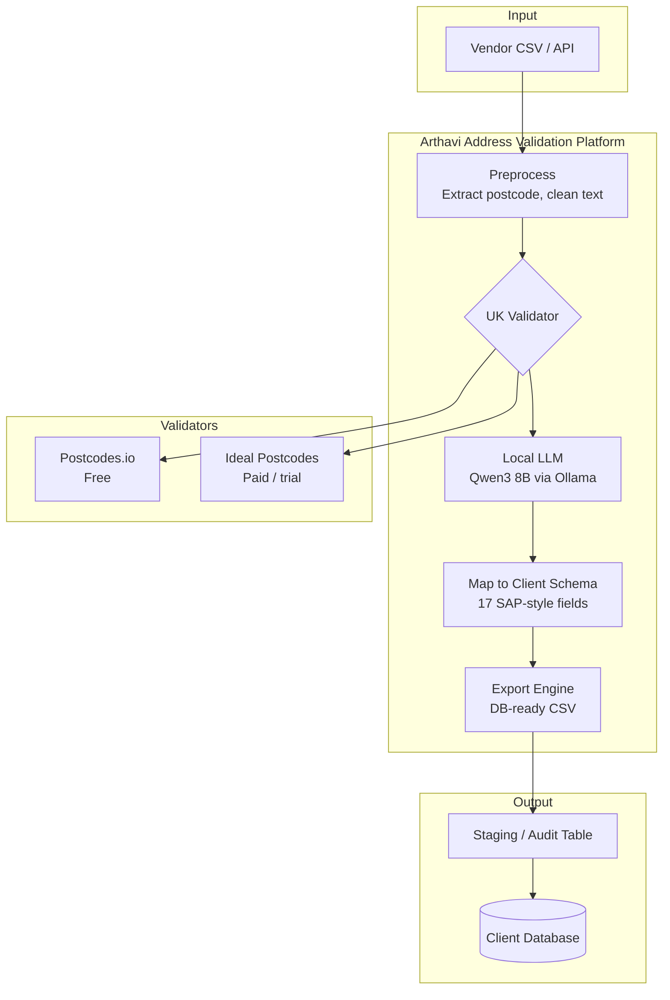
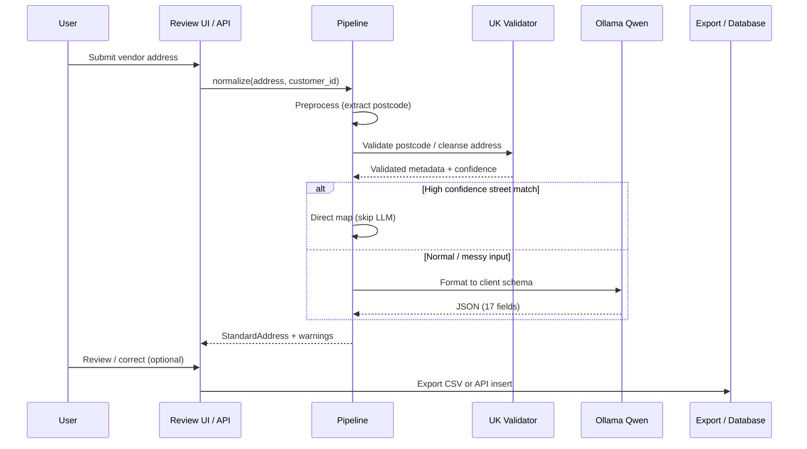
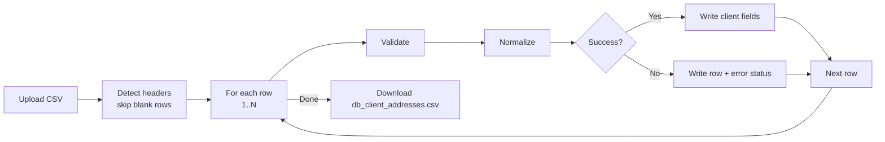
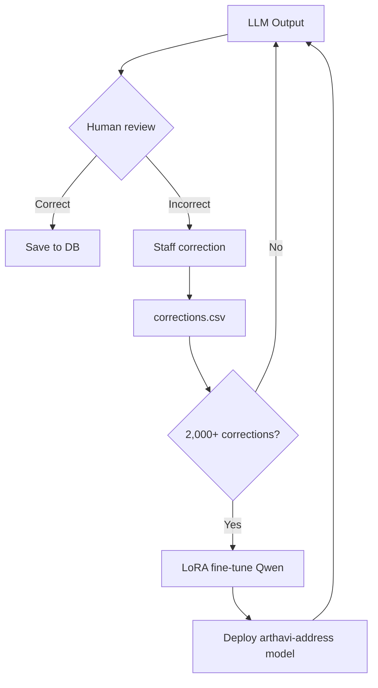

# Arthavi UK Address Validation Platform
## Client Proposal & Technical Overview

**Document version:** 1.0  
**Prepared by:** Arthavi  
**Date:** June 2026  
**Classification:** Client proposal — for presentation and technical review

---

## Table of contents

1. [Executive summary](#1-executive-summary)
2. [Business problem & proposed solution](#2-business-problem--proposed-solution)
3. [Application description](#3-application-description)
4. [Functional capabilities](#4-functional-capabilities)
5. [Technology stack & developer reference](#5-technology-stack--developer-reference)
6. [Architecture & process flow](#6-architecture--process-flow)
7. [Benefits: local LLM, validators & hybrid design](#7-benefits-local-llm-validators--hybrid-design)
8. [Why local LLM — not Ideal Postcodes alone](#8-why-local-llm--not-ideal-postcodes-alone)
9. [Royal Mail vs Ideal Postcodes — comparison](#9-royal-mail-vs-ideal-postcodes--comparison)
10. [Deployment phases & recommendations](#10-deployment-phases--recommendations)
11. [Security, privacy & compliance](#11-security-privacy--compliance)
12. [ROI & business case](#12-roi--business-case)
13. [Appendix](#13-appendix)

---

## 1. Executive summary

### The challenge

Organisations receiving UK customer addresses from vendors, partners, or legacy systems typically face:

- **Inconsistent formats** — free-text, mixed casing, missing fields, abbreviations
- **Unverified data** — postcodes may be invalid; street names may not exist
- **Manual effort** — staff spend hours correcting addresses before database load
- **Schema mismatch** — vendor layout does not match your ERP/CRM/SAP client address structure

### The solution

**Arthavi UK Address Validation** is an on-premise, AI-assisted address processing platform that:

1. **Validates** UK addresses against trusted postcode/address sources
2. **Normalizes** messy vendor text into your **predefined client address schema** (17 SAP-style fields)
3. **Exports** a database-ready CSV for direct import
4. **Learns** from human corrections over time (optional fine-tuning)

### Key value proposition

| Dimension | Outcome |
|-----------|---------|
| **Accuracy** | Trusted UK validation + intelligent field mapping |
| **Cost** | Start free (Postcodes.io); scale to paid validators only when needed |
| **Privacy** | Vendor data processed locally — no cloud LLM required |
| **Speed** | Batch process hundreds of addresses with live progress |
| **Control** | You own the pipeline, schema, and improvement loop |

### Recommended approach for client

| Phase | Validator | LLM | Cost profile |
|-------|-----------|-----|--------------|
| **Pilot (now)** | Postcodes.io (free) | Local Qwen 8B | Near-zero API cost |
| **Production** | Ideal Postcodes | Local Qwen 8B | ~£0.03–0.05 per lookup |
| **Enterprise** | Royal Mail PAF (direct or via provider) | Fine-tuned local model | Higher licence, maximum accuracy |

---

## 2. Business problem & proposed solution

### Typical vendor input

```
Flat 14 Flat 3, 51-53 Musters Road, West Bridgford, NG2 7QH, GB
COMEX 2000 UNIT 3 STADIUM BUSINESS COURT, MILLENNIUM WAY,PRIDE PARK,DERBY,DE24 8HP
```

### Required client output (database schema)

| Field | Example |
|-------|---------|
| Street 2 | Flat 14 Flat 3 |
| Street/House Number | 51-53 |
| Street 4 | Musters Road |
| District | Rushcliffe |
| Other City | Nottingham |
| Postal Code | NG2 7QH |
| Postal Code/City | NG2 7QH NOTTINGHAM |
| Country | GB |
| Time Zone | GMTUK |

### What we do *not* propose

- Training a brand-new LLM from scratch (expensive, unnecessary)
- Sending all vendor PII to OpenAI/ChatGPT (privacy risk, per-token cost)
- Relying on the LLM alone to validate addresses (LLMs can hallucinate)

### What we *do* propose

```
Vendor Address  →  UK Validator (trusted source)  →  Local LLM (formatting)  →  Client Schema  →  Database
```

**Validation = trusted UK data source. Formatting = local AI.**

---

## 3. Application description

### Product name

**Arthavi Address Validation & Review**

### Purpose

A web-based and API-driven platform that ingests vendor UK address files (CSV), validates each record, maps it to the client's predefined address structure, and produces an export file ready for database insertion.

### Users

| Role | Usage |
|------|-------|
| **Data operations** | Upload CSV, run batch, download DB file |
| **Address quality team** | Review exceptions, correct fields, save for training |
| **Developers** | Integrate via REST API, customize schema, swap validators |
| **IT / security** | Deploy on-premise, configure validators, monitor Ollama |

### Operating model

- Runs on **client infrastructure** (Mac, Linux server, or VM)
- **No mandatory cloud dependency** for AI inference
- Optional paid UK address APIs (Ideal Postcodes / Royal Mail) plug in via configuration

---

## 4. Functional capabilities

### 4.1 Batch processing

- Upload vendor CSV (single-line or multi-column formats)
- Auto-detect column mapping (`Customer ID`, `Address`, etc.)
- Process **each address sequentially** with live progress
- Download **`db_client_addresses.csv`** — includes all client fields + audit columns

### 4.2 Address validation

| Validator | Capability | Cost |
|-----------|------------|------|
| **Postcodes.io** | Postcode exists, region, district metadata | Free |
| **Ideal Postcodes** | Street-level cleanse, UPRN, confidence score | Pay-per-lookup |
| **Royal Mail PAF** (via provider) | Gold-standard delivery addresses | Licence + usage |

### 4.3 AI normalization (local LLM)

- Maps validated address + vendor text → 17-field client schema
- Handles abbreviations, casing, field splitting (flat vs street number vs street name)
- Builds `Postal Code/City` combined field automatically
- Sets `Country=GB`, `Time Zone=GMTUK` for UK addresses

### 4.4 Human review loop

- Review individual addresses in the UI
- Edit any field manually
- Save corrections → stored for future **LoRA fine-tuning**
- Continuous improvement without re-engineering rules

### 4.5 Export modes

| Export | Contents | Use case |
|--------|----------|----------|
| **DB CSV (full)** | Client fields + Processing Status + Vendor Address + Errors | Staging table / audit |
| **Client CSV (success only)** | Client fields only | Direct production DB load |

### 4.6 REST API

| Endpoint | Method | Purpose |
|----------|--------|---------|
| `/api/normalize` | POST | Single address normalization |
| `/api/import/batch/process` | POST | Batch with streaming progress |
| `/api/import/batch/export` | POST | Batch → CSV download |
| `/api/import/preview` | POST | Preview CSV column mapping |
| `/api/review` | POST | Save human correction |
| `/api/config` | GET | Server validator & model info |
| `/api/schema` | GET | Client address field definitions |
| `/health` | GET | Service health check |

---

## 5. Technology stack & developer reference

### 5.1 Stack overview

```
┌─────────────────────────────────────────────────────────────┐
│  Presentation    │  HTML/CSS/JS (Arthavi branded UI)        │
├──────────────────┼──────────────────────────────────────────┤
│  API layer       │  Flask 3.x (Python)                        │
├──────────────────┼──────────────────────────────────────────┤
│  Orchestration   │  AddressPipeline (preprocess→validate→LLM) │
├──────────────────┼──────────────────────────────────────────┤
│  Validation      │  Postcodes.io / Ideal Postcodes (pluggable)│
├──────────────────┼──────────────────────────────────────────┤
│  AI inference    │  Ollama + Qwen3 8B (local, on-premise)    │
├──────────────────┼──────────────────────────────────────────┤
│  Data model      │  Pydantic StandardAddress schema           │
├──────────────────┼──────────────────────────────────────────┤
│  Export          │  CSV (client + audit columns)              │
└─────────────────────────────────────────────────────────────┘
```

### 5.2 Core dependencies

| Component | Technology | Version / notes |
|-----------|------------|-----------------|
| Runtime | Python | 3.12+ |
| API framework | Flask | 3.x |
| HTTP client | requests | Postcodes.io / Ideal Postcodes |
| LLM client | ollama (Python SDK) | Talks to local Ollama |
| Schema validation | Pydantic | 2.x |
| AI runtime | Ollama | Desktop or server |
| LLM model | Qwen3 8B | ~5 GB RAM; fits 16 GB Mac |
| Testing | pytest | Unit + integration tests |

### 5.3 Project structure (for developers)

```
Address_Validation/
├── app.py                          # Flask API entry point
├── cli.py                          # Command-line batch tool
├── config/
│   ├── schema.json                 # Client address field definitions
│   └── vendor_mapping.json         # CSV column override config
├── static/
│   ├── index.html                  # Review UI
│   ├── css/app.css                 # Arthavi design system
│   └── js/app.js                   # Frontend logic
├── src/address_validation/
│   ├── preprocess.py               # Postcode extraction, text cleaning
│   ├── postcodes_io.py             # Free validator client
│   ├── ideal_postcodes.py          # Street-level validator client
│   ├── validator_factory.py        # Pluggable validator selection
│   ├── normalize.py                # Ollama LLM prompt + parsing
│   ├── pipeline.py                 # End-to-end orchestrator
│   ├── batch_processor.py          # CSV batch iterator
│   ├── export.py                   # DB-ready CSV generation
│   ├── vendor_import.py            # Smart CSV header detection
│   └── review_store.py             # Human correction logging
├── data/
│   ├── samples/                    # Test vendor CSVs
│   └── training/                   # Fine-tuning datasets
└── tests/                          # Automated test suite
```

### 5.4 Configuration (`.env`)

```bash
OLLAMA_MODEL=qwen3:8b
OLLAMA_HOST=http://localhost:11434
ADDRESS_VALIDATOR=postcodes_io          # or ideal_postcodes
IDEAL_POSTCODES_API_KEY=                  # when using Ideal Postcodes
IDEAL_POSTCODES_MIN_CONFIDENCE=0.75
FLASK_PORT=5050
```

### 5.5 Developer quick start

```bash
cd Address_Validation
python3 -m venv .venv && source .venv/bin/activate
pip install -r requirements.txt
cp .env.example .env
ollama serve                              # ensure Ollama is running
python app.py                             # → http://localhost:5050
python -m pytest tests/ -v               # run tests
```

### 5.6 Extension points

| Customization | How |
|---------------|-----|
| Client schema | Edit `config/schema.json` + `schema.py` |
| Vendor CSV columns | `config/vendor_mapping.json` override |
| Validator | `ADDRESS_VALIDATOR` env var |
| LLM model | `OLLAMA_MODEL` env var |
| Prompt tuning | `normalize.py` system prompt |
| Fine-tuned model | Phase 2 LoRA → export to Ollama |

---

## 6. Architecture & process flow

### 6.1 High-level architecture



### 6.2 Single-address processing flow



### 6.3 Batch CSV flow



### 6.4 Human-in-the-loop improvement



---

## 7. Benefits: local LLM, validators & hybrid design

### 7.1 Why use a UK validator at all?

| Benefit | Explanation |
|---------|-------------|
| **Factual accuracy** | Confirms postcode exists; Ideal/Royal Mail confirm street-level match |
| **Regulatory alignment** | Royal Mail PAF is the UK delivery standard |
| **Reduced returns** | Invalid addresses caught before dispatch |
| **Metadata enrichment** | District, region, UPRN, geocode from validator |

### 7.2 Why use a local LLM?

| Benefit | Explanation |
|---------|-------------|
| **Schema mapping** | Validators return *their* format; you need *your* 17 fields |
| **Messy text parsing** | "apt 3b 22 baker st" → structured fields |
| **Vendor-specific patterns** | Learns your supplier's quirks via corrections |
| **No per-token cloud cost** | Fixed hardware cost only |
| **Data stays on-premise** | GDPR-friendly; no vendor PII sent to OpenAI |
| **Works offline** | No internet required after model download (validator still needs network) |

### 7.3 Why hybrid (Validator + LLM) beats either alone

| Approach | Validation | Formatting | Risk |
|----------|------------|------------|------|
| **Validator only** | Excellent | Poor — doesn't know your schema | Manual mapping still needed |
| **LLM only** | Poor — can invent addresses | Good | Hallucination, compliance risk |
| **Hybrid (recommended)** | Excellent | Excellent | Low — each component does what it's best at |

### 7.4 Processing modes

| Mode | Validator | LLM | Speed | Accuracy | Best for |
|------|-----------|-----|-------|----------|----------|
| **Fast** | Postcodes.io | Skipped (rules) | ~1 sec/row | Good | High-volume pilot |
| **Standard** | Postcodes.io | Qwen 8B | ~30–180 sec/row | Better | Production MVP |
| **Premium** | Ideal Postcodes | Qwen 8B or skip if confidence ≥0.9 | Variable | Best | Delivery-critical data |

---

## 8. Why local LLM — not Ideal Postcodes alone

### 8.1 What Ideal Postcodes does well

- Validates and **cleanses** a free-text UK address
- Returns Royal Mail PAF-based structured lines (`line_1`, `line_2`, `post_town`, `postcode`)
- Provides **confidence score** and **UPRN**
- Excellent for answering: *"Is this a real UK address?"*

### 8.2 What Ideal Postcodes does *not* do

Ideal Postcodes returns **its** address format — not **your** client schema:

| Ideal Postcodes output | Your client schema |
|------------------------|-------------------|
| `line_1` | `street_2` or `co` |
| `line_2` | `street_house_number` + `street_4` |
| `post_town` | `other_city` |
| `postcode` | `postal_code` + `postal_code_city` |
| *(not provided)* | `time_zone`, `transportation_zone`, `reg_struct_grp`, `undeliverable`, `po_box_address` |

### 8.3 Real examples requiring LLM or rules

| Vendor input | Ideal Postcodes knows | Still needed |
|--------------|----------------------|--------------|
| `Flat 2, 10 high st, london, sw1a1aa` | Postcode valid, lines suggested | Split flat vs house number vs street; set GMTUK |
| `COMEX 2000 UNIT 3 STADIUM BUSINESS COURT...` | Partial match | Map org name to `street_2`/`street_3`; industrial estate to `street_5` |
| `Garage (5), The Retreat, Kingsdale Court...` | May match building | Interpret "Garage (5)" as `street_2` |

### 8.4 Cost comparison: Ideal Postcodes vs Ideal Postcodes + Local LLM

| Item | Ideal Postcodes only | Ideal Postcodes + Local LLM |
|------|---------------------|----------------------------|
| Per-address API cost | ~£0.03–0.05 | ~£0.03–0.05 (same) |
| LLM cost | £0 | £0 (local hardware) |
| Manual mapping labour | **High** — staff reformat every row | **Low** — automated |
| Schema compliance | Manual | Automated |
| Improvement over time | None | Fine-tune from corrections |

**Conclusion:** Ideal Postcodes validates *correctness*; the local LLM delivers *client readiness*. Both are required for zero-touch database loading.

### 8.5 When LLM can be skipped

If Ideal Postcodes returns **confidence ≥ 0.9**, the platform maps validated lines directly and **skips the LLM** — saving time while retaining accuracy. The LLM is used for ambiguous or messy vendor text.

---

## 9. Royal Mail vs Ideal Postcodes — comparison

> **Note:** Pricing changes periodically. Figures below are indicative based on published 2025/2026 rate cards. Confirm with suppliers before contract.

### 9.1 Summary comparison

| Criteria | Royal Mail PAF (direct) | Ideal Postcodes | Postcodes.io |
|----------|------------------------|-----------------|--------------|
| **Data source** | Royal Mail PAF (direct licence) | Royal Mail PAF (licensed reseller) | ONS / open postcode data |
| **Street-level validation** | Yes | Yes | No |
| **UPRN included** | Via solutions provider | Yes (included) | No |
| **Setup complexity** | High (licence agreements) | Low (API key) | None |
| **Typical entry cost** | £445+ data supply + licence fees | Free trial, then pay-as-you-go | Free |
| **Per-lookup cost** | ~£1.75–1.82/transaction (licence model) | ~£0.028–0.045/lookup | Free |
| **Website integration licence** | From ~£7,525/year | Included in API pricing | N/A |
| **Best for** | Large enterprise, bureau services | Mid-market production | MVP / pilot |

### 9.2 Royal Mail PAF — detail

**What it is:** The official UK Postcode Address File — ~30 million delivery addresses, maintained by Royal Mail under the Postal Services Act 2000.

**Licence models (indicative, ex VAT, from Oct 2025):**

| Licence type | Annual fee (indicative) |
|--------------|------------------------|
| Per user (full UK) | ~£105/user/year |
| Per transaction | ~£1.82/transaction |
| Website use (full UK) | ~£7,525/year |
| Organisation use | ~£22,600/year |
| Data supply (annual edition) | From ~£445/year |

**Benefits:**
- Gold standard for UK delivery accuracy
- Direct relationship with data owner
- Suitable for high-volume bureau / multi-brand operations
- Required for some regulated mail-order workflows

**Drawbacks:**
- Complex licensing (user, transaction, website, organisation models)
- Higher upfront commitment
- Requires Solutions Provider agreement for most integrations
- Does not map to your client schema — still needs formatting layer

### 9.3 Ideal Postcodes — detail

**What it is:** UK address API provider licensing Royal Mail PAF and Ordnance Survey AddressBase data. REST API with cleanse, lookup, and autocomplete.

**Pricing model (indicative):**

| Tier | Cost | Per lookup |
|------|------|------------|
| Free trial | ~50 credits | Free |
| 200 credits | ~£9 | ~£0.045 |
| 32,100 credits | ~£900 | ~£0.028 |
| Charity plans | From £9/month (2,000 req) | Substantially lower |

Credits valid **12 months** from first use. No monthly fee for standard pay-as-you-go.

**Benefits:**
- Fast to integrate (API key in minutes)
- Street-level cleanse with confidence score
- UPRN and geocode included
- Scales from pilot to production without licence negotiation
- Already integrated in Arthavi platform (drop-in)

**Drawbacks:**
- Per-lookup cost at scale (though far below direct Royal Mail transaction pricing)
- Reseller licence — not direct Royal Mail relationship
- Rate limit ~30 req/sec per IP (batch processing handles sequentially)

### 9.4 Postcodes.io — detail

**What it is:** Free, open UK postcode API (postcode existence, region, district, coordinates).

**Benefits:** Zero cost, no API key, ideal for pilot and postcode sanity checks.

**Limitation:** Does **not** verify street-level address. Cannot confirm "10 High Street" exists in a given postcode.

### 9.5 Decision matrix for client

| Your situation | Recommended validator |
|----------------|----------------------|
| Pilot / proof of concept (< 1,000 addresses) | **Postcodes.io** (free) |
| Production (< 100k addresses/year) | **Ideal Postcodes** |
| Enterprise mail-order / bureau (> 1M/year, compliance) | **Royal Mail PAF** (direct or enterprise provider) |
| Budget-constrained charity | **Ideal Postcodes charity plan** |

### 9.6 Cost illustration — 10,000 addresses/month

| Option | Estimated monthly cost | Notes |
|--------|----------------------|-------|
| Postcodes.io + Local LLM | **~£0** | Postcode-only validation |
| Ideal Postcodes + Local LLM | **~£280–450** | At £0.028–0.045/lookup |
| Royal Mail (transaction licence) | **~£18,200** | At ~£1.82/transaction |
| Royal Mail (website licence) | **~£627/month** | Amortised annual ~£7,525 |

*Royal Mail transaction pricing is typically for direct PAF API access. Most mid-market clients use Ideal Postcodes as a cost-effective PAF reseller.*

---

## 10. Deployment phases & recommendations

### Phase 1 — Pilot (weeks 1–2)

- Deploy on client Mac / VM
- Validator: **Postcodes.io** (free)
- LLM: **Qwen3 8B** via Ollama
- Process sample vendor file (e.g. 10–100 addresses)
- Review output quality in UI
- **Deliverable:** Validated DB CSV + accuracy report

### Phase 2 — Production (weeks 3–6)

- Enable **Ideal Postcodes** API key
- Set confidence threshold (0.75–0.90)
- Integrate export into client ETL / database load
- Train staff on review workflow
- **Deliverable:** Automated pipeline into staging table

### Phase 3 — Optimisation (month 2+)

- Collect human corrections (target 2,000+)
- Fine-tune Qwen with LoRA on client-specific patterns
- Deploy custom `arthavi-address` Ollama model
- Reduce LLM latency and improve field accuracy
- **Deliverable:** Client-specific AI model

### Phase 4 — Enterprise (optional)

- Evaluate direct Royal Mail PAF licence if volume/compliance requires
- Deploy on dedicated server with GPU (optional, for 14B model)
- API integration with upstream vendor feeds (automated, no CSV)

---

## 11. Security, privacy & compliance

| Concern | How we address it |
|---------|-------------------|
| **Data residency** | All processing on client infrastructure |
| **PII exposure** | No vendor addresses sent to cloud LLMs |
| **API keys** | Stored in `.env`, not in code |
| **Audit trail** | Export includes vendor original + processing status |
| **Human corrections** | Stored locally for model improvement |
| **GDPR** | Local processing minimises third-party data sharing |
| **Royal Mail terms** | Ideal Postcodes / Royal Mail licences govern validation data use |

---

## 12. ROI & business case

### Without automation (typical)

| Activity | Time per address | 10,000 addresses |
|----------|-----------------|------------------|
| Manual validation (web lookup) | 2–3 min | 333–500 hours |
| Manual reformatting to schema | 1–2 min | 167–333 hours |
| **Total** | **3–5 min** | **500–833 hours** |

At £25/hour loaded cost: **£12,500–£20,825 per 10,000 addresses**

### With Arthavi platform

| Activity | Time per address | 10,000 addresses |
|----------|-----------------|------------------|
| Batch upload + process | ~5 sec (fast mode) | ~14 hours (unattended) |
| Human review (10% exceptions) | 2 min × 1,000 | ~33 hours |
| **Total labour** | | **~47 hours** |

At £25/hour: **~£1,175** + Ideal Postcodes API (~£350) = **~£1,525 total**

### Estimated savings per 10,000-address batch

**£11,000–£19,000** (85–92% reduction in labour)

### Intangible benefits

- Faster time-to-database for new vendor feeds
- Consistent schema compliance
- Reduced delivery failures and customer complaints
- Auditable processing with success/fail status per row
- Continuous improvement via correction loop

---

## 13. Appendix

### A. Client address schema (full)

| # | Field | JSON key | Example |
|---|-------|----------|---------|
| 1 | c/o | `co` | |
| 2 | Street 2 | `street_2` | Flat 2 |
| 3 | Street 3 | `street_3` | |
| 4 | Street/House Number | `street_house_number` | 10 |
| 5 | Street 4 | `street_4` | High Street |
| 6 | Street 5 | `street_5` | |
| 7 | District | `district` | Westminster |
| 8 | Other City | `other_city` | London |
| 9 | Postal Code/City | `postal_code_city` | SW1A 1AA LONDON |
| 10 | Country | `country` | GB |
| 11 | Time Zone | `time_zone` | GMTUK |
| 12 | Transportation Zone | `transportation_zone` | |
| 13 | Reg. Struct. Grp. | `reg_struct_grp` | |
| 14 | Undeliverable | `undeliverable` | |
| 15 | PO Box Address | `po_box_address` | |
| 16 | PO Box | `po_box` | |
| 17 | Postal Code | `postal_code` | SW1A 1AA |

### B. Hardware requirements

| Component | Minimum | Recommended |
|-----------|---------|-------------|
| RAM | 16 GB | 32 GB |
| Storage | 10 GB | 20 GB |
| CPU | Apple M-series / 4-core x86 | 8-core |
| GPU | Not required | Apple Silicon unified memory helps |
| Network | Required for validators | Stable broadband |

### C. Presentation slide outline

Use this document to build slides:

1. Title — Arthavi UK Address Validation
2. Executive summary (Section 1)
3. The problem — messy vendor data
4. Our solution — hybrid architecture diagram (Section 6.1)
5. Live demo screenshot — batch upload → progress → download
6. Client schema — 17 fields table (Appendix A)
7. Technology stack (Section 5)
8. Why not LLM alone / validator alone (Section 7.3)
9. Why local LLM + Ideal Postcodes (Section 8)
10. Royal Mail vs Ideal Postcodes comparison table (Section 9.1)
11. Cost illustration (Section 9.6)
12. ROI / business case (Section 12)
13. Security & privacy (Section 11)
14. Phased rollout plan (Section 10)
15. Recommendation & next steps

### D. References

- [Ideal Postcodes API](https://ideal-postcodes.co.uk)
- [Ideal Postcodes pricing / credits](https://docs.ideal-postcodes.co.uk/docs/guides/purchasing-lookups)
- [Royal Mail Powered by PAF pricing](https://www.poweredbypaf.com/pricing-solutions-provider/)
- [Postcodes.io](https://postcodes.io)
- [Ollama](https://ollama.com)
- Project README: `/Users/sanat/Address_Validation/README.md`

---

**Prepared by Arthavi**  
*Intelligent automation. Local control. Client-ready data.*
