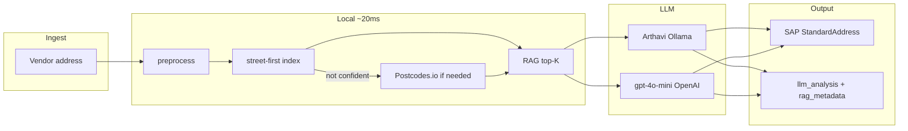

# RAG Option — UK Address Validation

## Overview

Retrieval-Augmented Generation (RAG) grounds both **Arthavi LLM** (local Ollama) and **Azure OpenAI** with real mapping examples from your project knowledge base before each normalization call.

This improves accuracy on vendor-specific UK address patterns without waiting for a full model retrain.

## Problem RAG Solves

Generic LLMs know UK addresses broadly, but your SAP schema has **client-specific field placement**:

- `street_2` vs `street_3` for flats and yards  
- Business parks (`PRIDE PARK` in `street_4`, road in `street_5`)  
- Reversed space-separated inputs (`Apartment 7 Elliot's Yard 8 Gulson Road…`)  

RAG retrieves **similar past corrections** and injects them into the prompt as few-shot guidance.

## Architecture & execution flow

### End-to-end (gpt-4o-mini / Arthavi — shared validation + RAG)



### Text flow

```text
Vendor address
   → preprocess (extract postcode, clean text)
   → Local address index (data/local/uk_addresses.json.gz, ~13 KB gzip)
        ├─ Postcode in text? → postcode-first bucket lookup
        ├─ Missing / wrong PC? → street-first full-index scan (~1–15 ms)
        ├─ High confidence → skip Postcodes.io (tier: street_first_resolved)
        └─ Low confidence / unknown → Postcodes.io fallback (~200 ms)
              └─ rejected? → street-first recovery
   → RAG retrieve top-K + inject local_lookup into prompt
        ├─ data/review/corrections.csv (human corrections, highest weight)
        └─ data/training/from_corrections.jsonl (training pairs)
   → LLM provider (Arthavi or gpt-4o-mini via Azure UI) with enriched user prompt
   → StandardAddress schema enforcement
   → SAP output + RAG metadata + llm_analysis in API/UI
```

Build the local index: `python tools/build_local_address_index.py` (sources: corrections, synthetic training, postcodes cache; optional `LOCAL_OA_CSV_URL` for OpenAddresses CSV).

**Street-first lookup** (`LOCAL_STREET_FIRST=1`): when postcode is missing or Postcodes.io rejects it, scan the index by street/number/building tokens to recover the correct postcode before RAG + LLM (~1–5 ms overhead).

RAG is **provider-agnostic** — the same retrieval layer feeds both Ollama and Azure.

## Knowledge Base Sources

| Source | Priority | Content |
|--------|----------|---------|
| `data/review/corrections.csv` | High (weight 2.0) | Human-approved vendor → SAP mappings |
| `data/training/from_corrections.jsonl` | Normal (weight 1.0) | Exported instruction pairs |

New corrections saved in the UI are included on the next request (index reloads per process).

## Retrieval Method

Lightweight **token overlap + postcode match** (no external vector DB required for POC):

- Token Jaccard similarity on normalized address text  
- Bonus when postcodes match  
- Exact duplicate inputs excluded  
- Top **K** examples (default 3) above relevance threshold  

Configurable via `.env`:

```env
RAG_ENABLED=1
RAG_TOP_K=3
RAG_MAX_EXAMPLES=200
RAG_CORRECTIONS_PATH=data/review/corrections.csv
RAG_JSONL_PATH=data/training/from_corrections.jsonl
```

## Benefits for Client

| Benefit | Description |
|---------|-------------|
| **Higher accuracy on edge cases** | COMEX, Elliot's Yard, multi-flat patterns |
| **Immediate learning** | Corrections usable without retrain cycle |
| **Explainability** | UI shows which examples influenced the prompt |
| **Provider flexibility** | Same RAG for Arthavi and Azure benchmarks |
| **Lower regression risk** | Grounds cloud model in your approved mappings |

## RAG vs Fine-Tuning

| | RAG | Fine-tune (`arthavi-address`) |
|--|-----|-------------------------------|
| Update speed | Immediate (new CSV rows) | Retrain + redeploy |
| Cost | Small extra prompt tokens | Training time / compute |
| Best for | Few-shot patterns, client demos | Baked-in behavior at scale |
| Together | **Recommended** — RAG + fine-tune complement each other |

## API Usage

```json
POST /api/normalize
{
  "address": "Apartment 7 Elliot's Yard 8 Gulson Road Coventry CV1 2NF",
  "llm_provider": "azure",
  "use_rag": true
}
```

Response includes:

```json
"rag_metadata": {
  "enabled": true,
  "examples_count": 7,
  "hits": [
    {
      "vendor_address": "8 Gulson Road Apartment 7 Elliot's Yard Coventry CV12NF",
      "mapped": { "street_2": "Apartment 7", "..." : "..." },
      "source": "human_correction",
      "score": 0.82
    }
  ]
}
```

## UI

Step 4 → enable **Use RAG** → run single-address test.  
The **LLM analysis** panel shows retrieved examples and relevance scores.

## Future Enhancements (Phase 2)

- Embedding-based retrieval (Ollama `nomic-embed-text` or Azure embeddings)  
- Per-client knowledge bases  
- Automatic index refresh on correction save  
- RAG hit quality metrics in batch export  

## Recommendation

- **Pilot:** RAG ON for both providers during client UAT  
- **Production:** RAG ON + local `arthavi-address` for cost/privacy; Azure + RAG for benchmark / fallback  
- **Governance:** Treat RAG hits as auditable context alongside `llm_analysis` token/cost data  
