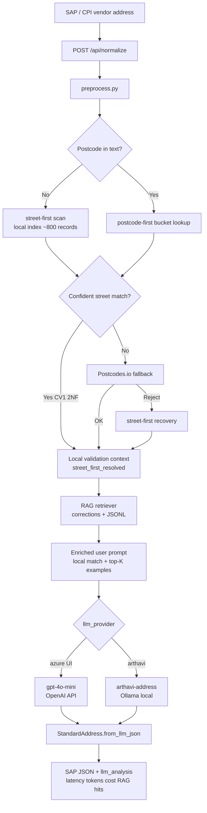

# UK Address Validation POC (Cloud LLM — gpt-4o-mini)

## Objective

Validate and normalize UK vendor addresses into the SAP target schema using **gpt-4o-mini**, with measurable token usage, latency, and cost per request — compared against local **Arthavi LLM** (Ollama, zero API cost).

## Cloud Setup Used (Current)

- **UI provider label:** Azure OpenAI
- **Backend:** Direct OpenAI API (`LLM_PROVIDER=openai`)
- **Model:** `gpt-4o-mini-2024-07-18`
- **API key source:** VidyAI project `.env` (`OPENAI_API_KEY`, loaded via `VIDYAI_ENV_FILE`)
- **Local validation:** Street-first index (`data/local/uk_addresses.json.gz`) → Postcodes.io fallback when not confident
- **RAG:** Enabled — similar corrections injected before LLM call

> Note: keep API keys only in `.env` (never in docs or `.env.example`).

### Prior Azure Foundry benchmark (reference)

| Deployment | Latency | Tokens | Cost / request |
|------------|---------|--------|----------------|
| Kimi-K2.6 (Azure Foundry) | 14.3 s | 3,104 | $0.001351 |
| **gpt-4o-mini (OpenAI)** | **6.7 s** | **1,602** | **$0.000330** |

gpt-4o-mini is ~**2.1× faster**, ~**48% fewer tokens**, and ~**4× cheaper** per request vs Kimi-K2.6 on the comparable Elliot's Yard pattern.

## Execution Flow

End-to-end path for the gpt-4o-mini POC run (`8 Gulson Road Coventry Apartment 7 Elliot's Yard` — postcode missing in vendor text).

### High-level diagram



### Step-by-step (code path)

| Step | Module | What happens |
|------|--------|----------------|
| 1 | `app.py` → `POST /api/normalize` | Receives address; `llm_provider: "azure"` routes to cloud path (OpenAI when `LLM_PROVIDER=openai`) |
| 2 | `preprocess.py` | Cleans text; extracts postcode → **none** for this input |
| 3 | `local_address_store.lookup()` | **Street-first** scans index by tokens (`Gulson`, `Elliot`, `Coventry`, …) → match `CV1 2NF` (~5 ms) |
| 4 | `local_validator.py` | `validation_tier: street_first_resolved`, `street_level_validated: true`, Postcodes.io **skipped** |
| 5 | `rag/retriever.py` | Retrieves similar correction (Elliot's Yard pattern); attaches `local_lookup` block to prompt |
| 6 | `azure_normalize.run_azure_normalize()` | Builds compact validation context + RAG block → **gpt-4o-mini** JSON mode |
| 7 | `schema.StandardAddress` | Maps LLM JSON to SAP fields (`street_2`…`postal_code_city`) |
| 8 | API response | `normalized_address`, `llm_validation`, `rag_metadata`, `llm_analysis` (latency, tokens, cost vs Arthavi) |

### Decision logic (validation tier)

```text
preprocess
  │
  ├─ postcode present?
  │     ├─ yes → postcode-first lookup in local index
  │     └─ no  → street-first full-index scan
  │
  ├─ address_confident (≥ LOCAL_ADDRESS_MIN_CONFIDENCE)?
  │     └─ yes → street_first_resolved / local_high_confidence → skip Postcodes.io
  │
  ├─ postcode_confident but weak street?
  │     └─ local_postcode_confident (optional skip Postcodes.io)
  │
  └─ else → Postcodes.io validate
        ├─ valid   → postcodes_io_fallback (+ local street hints if any)
        └─ invalid → street-first recovery → street_first_after_postcodes_reject
              └─ still no match → 422 (Arthavi) or LLM-only guess (skip_validation)
```

### Timing profile (actual gpt-4o-mini run)

| Stage | Typical time | This POC run |
|-------|----------------|--------------|
| Preprocess | &lt; 1 ms | ✓ |
| Street-first local lookup | 1–15 ms | ~13 ms |
| Local validator | 2–10 ms | ~5 ms |
| RAG retrieval | 1–5 ms | ✓ (included in prompt build) |
| **gpt-4o-mini inference** | **1–8 s** | **6,701 ms** |
| Schema mapping | &lt; 1 ms | ✓ |
| **Total (API perceived)** | **~7 s** | **~6.7 s** |

Local validation + RAG add **~20 ms**; cloud LLM dominates latency.

### Arthavi vs cloud (same flow, different LLM step)

```text
                    ┌── street-first + RAG (shared) ──┐
                    │                                  │
Vendor address ──► preprocess ──► local index ──► RAG ──┬──► arthavi-address (Ollama)  → $0
                                                         └──► gpt-4o-mini (OpenAI)       → $0.000330
```

Both providers receive the **same** validation context and RAG examples; only step 6 (LLM call) differs.

## POC Flow (summary)

1. Input vendor address from SAP/CPI-style payload.
2. **Street-first local lookup** — resolve postcode from street/building tokens when missing or wrong (~5 ms).
3. **Postcodes.io fallback** when local index is not confident (~200 ms).
4. **RAG** — retrieve similar corrected examples from knowledge base.
5. Send enriched prompt to **gpt-4o-mini**.
6. Enforce SAP schema fields through `StandardAddress`.
7. Return normalized fields, `llm_validation` flags, token/cost report, and Arthavi comparison.

## Test Case Executed (gpt-4o-mini)

**Input address**

`8 Gulson Road Coventry Apartment 7 Elliot's Yard`

(Postcode omitted in vendor text — resolved locally via street-first lookup to `CV1 2NF` before LLM mapping.)

**Output (normalized)**

- `street_2`: `APARTMENT 7`
- `street_3`: `ELLIOT'S YARD`
- `street_house_number`: `8`
- `street_4`: `GULSON ROAD`
- `district`: `COVENTRY`
- `other_city`: `COVENTRY`
- `postal_code`: `CV1 2NF`
- `postal_code_city`: `CV1 2NF COVENTRY`
- `country`: `GB`
- `time_zone`: `GMTUK`

This output matches the expected human-corrected mapping for this address pattern.

## Token and Cost Result (Actual Run — gpt-4o-mini)

Mapped with **Azure OpenAI (gpt-4o-mini-2024-07-18)**. Token and cost metrics below compared with local Arthavi LLM.

| Metric | gpt-4o-mini | Arthavi LLM (local) |
|--------|-------------|---------------------|
| **Provider** | OpenAI API | Ollama `arthavi-address` |
| **Latency** | **6,701 ms** | ~2–8 s (hardware dependent) |
| **Total tokens** | **1,602** | 0 (local) |
| **Cost / request** | **$0.000330** | **$0.00** |

Volume projection using this run profile:

- **1,000 addresses:** ~$0.33
- **10,000 addresses:** ~$3.30
- **100,000 addresses:** ~$33.00
- **1,000,000 addresses:** ~$330.00

## Configuration (Simplified)

Use this in project root `.env`:

```env
LLM_PROVIDER=openai
OPENAI_MODEL=gpt-4o-mini
VIDYAI_ENV_FILE=/Users/sanat/Education/vidyai/.env

LOCAL_STREET_FIRST=1
RAG_ENABLED=1
POSTCODES_IO_BASE=https://api.postcodes.io
```

The OpenAI key lives in the VidyAI `.env` (`OPENAI_API_KEY`). To use Azure Foundry instead, set `LLM_PROVIDER=azure` and configure `AZURE_OPENAI_*` variables.

## How to Run

**Main app (UI + API):**

```bash
cd /Users/sanat/Address_Validation
source .venv/bin/activate
python app.py
# UI: http://localhost:5050 — select Azure OpenAI provider, enable RAG
```

**Street-first + gpt-4o-mini POC script:**

```bash
PYTHONPATH=src LLM_PROVIDER=openai OPENAI_MODEL=gpt-4o-mini \
  python tools/poc_street_first_gpt4o_mini.py
```

**Legacy Azure Foundry POC:**

```bash
cd poc/azure_uk_address
python tools/check_azure_deployment.py
python run_poc.py
```

## Deliverables Produced

- Main pipeline: `src/address_validation/azure_normalize.py` (OpenAI + Azure)
- Street-first index: `data/local/uk_addresses.json.gz`, `tools/build_local_address_index.py`
- RAG: `src/address_validation/rag/`, `docs/RAG_OPTION.md`
- POC runner: `tools/poc_street_first_gpt4o_mini.py`
- Legacy POC: `poc/azure_uk_address/run_poc.py`
- Prior Kimi result: `poc/azure_uk_address/results/poc_20260617_205805.json`

## Recommendation

- **Client demos / cloud benchmark:** gpt-4o-mini + street-first + RAG (~6.7 s, ~$0.00033/address).
- **Production / privacy / cost:** Arthavi LLM (Ollama) + street-first + RAG — $0 API cost.
- **Authoritative postcode recovery at scale:** Ideal Postcodes (paid) for addresses outside the local index.
